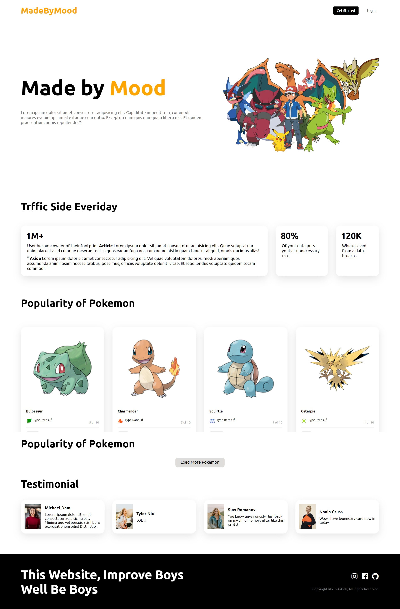

# Catatan

Readme ini menunjukan implementasi HTML dan CSS untuk menunjukan implementasi dan penerapa tahnologi Flexbox pada CSS pada sebuah landing page

dari kesalahan yang pernaj di lakukan maka

1. identifikasi kelas
2. memnbuat prototipe sederhana untuk di jadikan acuan coding ke depan

# Tertarik Mencoba

Lakukan langkah berikut

1. buka aplikasi git bash

2. git clone https://github.com/nurkholisal3kanjarmaruf/Landing-Page.git

3. tempatkan posisi folder pada folder yang kamu gunakan lalu masukan ke dalam kode editor favorit kalian dan open in browser atau kalian bisa membuka tautan berikut https://landing-page-liard-nine.vercel.app/

maka kurang lebih akan menampilkan hasil seperti di bawah

# Preview

